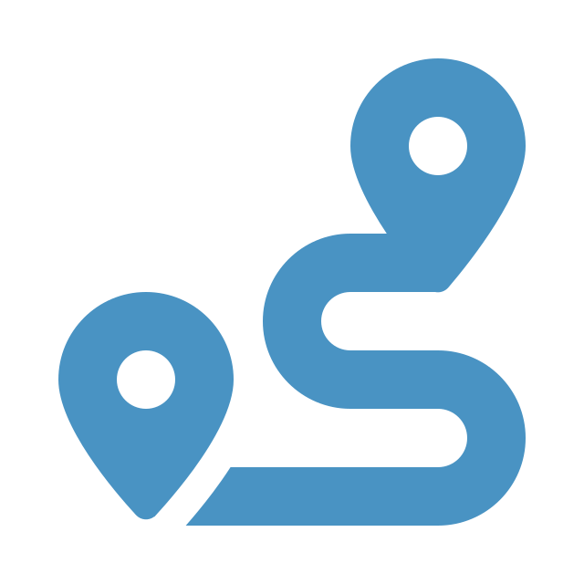
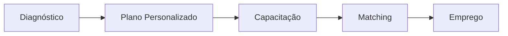

<div align="center">
  
  
  # Rota Certa
  ### GPS da Requalificação Profissional
  
  
  
  
  
  <p align="center">
    <a href="#-sobre-o-projeto">Sobre</a> •
    <a href="#-problema-e-solução">Problema</a> •
    <a href="#-tecnologias">Tecnologias</a> •
    <a href="#-equipe">Equipe</a> •
    <a href="#-estrutura">Estrutura</a> •
    <a href="#-como-usar">Como Usar</a>
  </p>
</div>

---

## 📋 Sobre o Projeto

O **Rota Certa** é uma plataforma inovadora desenvolvida para o **Global Solution 2025 da FIAP** que tem como objetivo revolucionar o processo de requalificação profissional no Brasil. Nosso sistema atua como um **GPS inteligente**, guiando trabalhadores desempregados ou em transição de carreira através de uma jornada personalizada de capacitação e recolocação no mercado de trabalho.

### 🎯 Propósito

Em um cenário onde:
- **12 milhões** de brasileiros estão desempregados
- **60%** precisam de requalificação profissional
- **85%** não sabem por onde começar sua requalificação

O Rota Certa surge como uma solução completa que conecta profissionais às oportunidades certas, oferecendo:

✅ **Diagnóstico Personalizado** - Avaliação de habilidades e perfil profissional através de um termômetro de empregabilidade  
✅ **Rotas Customizadas** - Jornadas de aprendizado adaptadas às necessidades individuais e demandas do mercado  
✅ **Matching Inteligente** - Algoritmo que conecta profissionais às melhores oportunidades  
✅ **Acompanhamento Contínuo** - Suporte em todas as etapas da jornada de requalificação  
✅ **Impacto Social** - Alinhamento com os Objetivos de Desenvolvimento Sustentável da ONU (ODS 4, 8 e 10)

### 🌟 Diferenciais

- **Interface Intuitiva**: Design moderno e acessível, pensado para diferentes níveis de familiaridade digital
- **Experiência Personalizada**: Cada usuário tem sua própria jornada baseada em suas características únicas
- **Tecnologia Acessível**: Plataforma web responsiva que funciona em qualquer dispositivo
- **Foco em Resultados**: Sistema orientado a metas concretas de empregabilidade

---

## 🔍 Problema e Solução

### O Problema

O mercado de trabalho brasileiro enfrenta desafios estruturais que afetam milhões de pessoas:

1. **Desemprego Massivo**: 12+ milhões de pessoas buscando oportunidades
2. **Gap de Qualificação**: 60% dos desempregados precisam de requalificação
3. **Desorientação**: 85% não sabem como iniciar sua jornada de requalificação
4. **Desigualdade**: Falta de acesso democrático a recursos de capacitação

### Nossa Solução

O Rota Certa oferece uma **plataforma completa de requalificação profissional** que integra:



**1. Termômetro de Empregabilidade**  
Avaliação inicial que mapeia habilidades, experiências e potencial do profissional

**2. Rotas de Aprendizado**  
Jornadas personalizadas com cursos, mentorias e recursos alinhados ao perfil

**3. Algoritmo de Matching**  
Conexão inteligente entre profissionais qualificados e oportunidades reais do mercado

**4. Acompanhamento Ativo**  
Dashboard com métricas de progresso e suporte contínuo

---

## 🛠️ Tecnologias

### Frontend

<div align="center">
  


</div>

- **HTML5**: Estrutura semântica e acessível
- **CSS3**: Design responsivo com Flexbox e Grid Layout
  - Glassmorphism para efeitos visuais modernos
  - Animations e Transitions para interatividade
  - Media Queries para adaptação a diferentes telas
- **JavaScript ES6+**: Interatividade e manipulação do DOM
  - Intersection Observer API para animações on-scroll
  - Menu mobile responsivo
  - Validação de formulários

### Design e UX
<div align="center">
  


</div>

- **Poppins**: Tipografia para títulos e destaques
- **Open Sans**: Tipografia para textos e parágrafos
- **Font Awesome 6.5.1**: Biblioteca de ícones vetoriais

### Boas Práticas Implementadas
- ✅ Mobile-First Design
- ✅ Acessibilidade (ARIA labels, semantic HTML)
- ✅ SEO Optimizado (meta tags, structured data)
- ✅ Performance (lazy loading, otimização de imagens)
- ✅ Cross-browser compatibility
- ✅ Versionamento com Git

---

## 👥 Equipe

<div align="center">
  
  
  ### Cod3X - Code + 3 Members + X Factor
  
  *"Transformando problemas reais em soluções inovadoras através da tecnologia"*
</div>

<br>

### 🧑‍💻 Integrantes

<table align="center">
  <tr>
    <td align="center">
      <br>
      <sub><b>Gabriel Stuani</b></sub><br>
      <sub>Desenvolvedor Full Stack</sub><br><br>
      <sub>📋 <b>RM:</b> 566682</sub><br>
      <sub>🎓 <b>Turma:</b> 1TDSPB</sub><br><br>
      <a href="https://www.linkedin.com/in/gabriel-stuani-b20930324/" target="_blank">
        
      </a>
      <a href="https://github.com/Gstuani" target="_blank">
        
      </a><br>
      <sub><i>🔧 Arquitetura • Backend • APIs • Banco de Dados</i></sub><br>
      <sub>💡 Python • JavaScript • React • Node.js • SQL</sub>
    </td>
    <td align="center">
      <br>
      <sub><b>Pablo Garcia</b></sub><br>
      <sub>UX/UI Designer & Frontend</sub><br><br>
      <sub>📋 <b>RM:</b> 568074</sub><br>
      <sub>🎓 <b>Turma:</b> 1TDSPB</sub><br><br>
      <a href="https://www.linkedin.com/in/pabloedinha/" target="_blank">
        
      </a>
      <a href="https://github.com/pabloedinha" target="_blank">
        
      </a><br>
      <sub><i>🎨 Design UI/UX • Frontend • Experiência do Usuário</i></sub><br>
      <sub>💡 HTML/CSS • Figma • Design • Responsive • UX Research</sub>
    </td>
    <td align="center">
      <br>
      <sub><b>Guilherme Soares</b></sub><br>
      <sub>Data Scientist & Backend</sub><br><br>
      <sub>📋 <b>RM:</b> 568227</sub><br>
      <sub>🎓 <b>Turma:</b> 1TDSPB</sub><br><br>
      <a href="https://www.linkedin.com/in/guilherme-soares-alberti/" target="_blank">
        
      </a>
      <a href="https://github.com/Guilherme-Soares00" target="_blank">
        
      </a><br>
      <sub><i>📊 Algoritmo de Matching • Análise de Dados • ML</i></sub><br>
      <sub>💡 Java • Data Analysis • Machine Learning • APIs</sub>
    </td>
  </tr>
</table>

---

## 📁 Estrutura do Projeto

```
Global_Solution_Rota_Certa/
│
├── 📄 index.html                 # Página inicial (landing page)
├── 📄 README.md                  # Documentação do projeto
│
├── 📁 assets/                    # Recursos multimídia
│   ├── logo.svg                  # Logo principal do projeto
│   ├── logo.ico                  # Favicon
│   ├── cod3x.png                 # Logo da equipe
│   ├── gabriel.jpg               # Foto - Gabriel Stuani
│   ├── pablo.jpg                 # Foto - Pablo Garcia
│   ├── guilherme.jpeg            # Foto - Guilherme Soares
│   ├── maria.jpg                 # Depoimento - Maria Silva
│   ├── carlos.jpg                # Depoimento - Carlos Mendes
│   ├── ana.jpg                   # Depoimento - Ana Costa
│   ├── pessoas.jpg               # Imagem ilustrativa - Hero
│   ├── pessoas2.jpg              # Imagem ilustrativa - Sobre
│   ├── onu4.svg                  # ODS 4 - Educação de Qualidade
│   ├── onu8.svg                  # ODS 8 - Trabalho Decente
│   └── onu10.svg                 # ODS 10 - Redução das Desigualdades
│
├── 📁 css/                       # Folhas de estilo (CSS3 + Variáveis CSS)
│   ├── style.css                 # Estilos globais (header, footer, botões)
│   ├── index-style.css           # Estilos da página inicial
│   ├── sobre-style.css           # Estilos da página sobre
│   ├── integrantes-style.css     # Estilos da página de integrantes
│   ├── faq-style.css             # Estilos da página de FAQ
│   ├── contato-style.css         # Estilos da página de contato
│   ├── rota-style.css            # Estilos do questionário de diagnóstico
│   └── aprendizado-style.css     # Estilos da jornada de aprendizado
│
├── 📁 js/                        # Scripts JavaScript (ES6+)
│   ├── menu.js                   # Menu mobile responsivo
│   ├── geral.js                  # Funções globais (scroll to top, animações)
│   ├── index.js                  # Interatividade da home
│   ├── integrantes.js            # Cards flip da equipe
│   ├── faq.js                    # Acordeon de perguntas
│   ├── contato.js                # Validação de formulário de contato
│   ├── rota.js                   # Lógica do questionário e diagnóstico
│   └── aprendizado.js            # Dashboard de progresso e gamificação
│
└── 📁 pages/                     # Páginas HTML secundárias
    ├── sobre.html                # Sobre o projeto e impacto social
    ├── integrantes.html          # Equipe Cod3X e contribuições
    ├── faq.html                  # Perguntas frequentes
    ├── contato.html              # Formulário de contato e localização
    ├── rota.html                 # Questionário de diagnóstico profissional
    └── aprendizado.html          # Jornada de aprendizado gamificada
```

### 📂 Descrição dos Diretórios

- **`assets/`**: Todos os recursos visuais otimizados (imagens, ícones, logos SVG)
- **`css/`**: Arquivos de estilização modular com variáveis CSS para design system consistente
- **`js/`**: Scripts de interatividade, validação e lógica de negócio do frontend
- **`pages/`**: Sistema completo de 6 páginas HTML interconectadas com navegação fluida

---

## 🎨 Imagens e Ícones

<div align="center">
  
#### Processo de Requalificação


*Visualização da jornada de requalificação profissional que buscamos*

</div>

### Objetivos de Desenvolvimento Sustentável (ODS)

O projeto está alinhado com os seguintes ODS da ONU:

<div align="center">
  
  
  
</div>

- **ODS 4** - Educação de Qualidade: Promovendo acesso à capacitação profissional
- **ODS 8** - Trabalho Decente e Crescimento Econômico: Facilitando a empregabilidade
- **ODS 10** - Redução das Desigualdades: Democratizando oportunidades de requalificação

---

## 🚀 Como Usar

### Pré-requisitos

Para executar este projeto, você precisa apenas de:
- Um navegador web moderno (Chrome, Firefox, Safari, Edge)
- Conexão com a internet (para carregar fontes e ícones externos)

### Instalação

1. **Clone o repositório**
```bash
https://github.com/FIAP-Cod3X/Global_Solution_Rota_Certa.git
```

2. **Navegue até o diretório do projeto**
```bash
cd rota-certa
```

3. **Abra o arquivo `index.html` no navegador**

**Opção 1**: Clique duas vezes no arquivo `index.html`

**Opção 2**: Use a extensão Live Server no VS Code
```bash
# Instale a extensão Live Server
# Clique com botão direito em index.html > "Open with Live Server"
```

**Opção 3**: Acesse nosso site hospedado pelo GitHub:

<a href="https://fiap-cod3x.github.io/Global_Solution_Rota_Certa/">Rota Certa</a>


### Navegação

O site possui as seguintes páginas completas:

- **🏠 Início** (`index.html`): Landing page com hero, depoimentos, funcionalidades e CTA
- **📖 Sobre** (`pages/sobre.html`): Detalhes do projeto, problema, solução, impacto social e ODS
- **👥 Integrantes** (`pages/integrantes.html`): Equipe Cod3X com cards flip interativos e contribuições
- **❓ FAQ** (`pages/faq.html`): Acordeon de perguntas com sistema de busca e filtros por categoria
- **📧 Contato** (`pages/contato.html`): Canais de atendimento e mapa interativo da localização
- **🧭 Rota** (`pages/rota.html`): Questionário inteligente para diagnóstico profissional
- **🎓 Aprendizado** (`pages/aprendizado.html`): Dashboard gamificado com trilha de módulos e conquistas

### Funcionalidades Interativas

- ✨ **Menu Responsivo**: Menu hambúrguer animado para navegação mobile
- 🎯 **Animações Suaves**: Efeitos fade-in e slide-up ao scrollar usando Intersection Observer API
- 💳 **Cards Flip 3D**: Cards interativos na página de integrantes com informações frente/verso
- 📝 **Validação de Formulários**: Validação client-side em tempo real com mensagens de erro
- 🎨 **Design Adaptativo**: Interface totalmente responsiva com breakpoints otimizados
- 🔍 **Sistema de Busca**: Filtro dinâmico de perguntas no FAQ
- 📊 **Questionário Inteligente**: Diagnóstico profissional com 10 perguntas e resultado personalizado
- 🏆 **Gamificação**: Sistema de progresso, conquistas e badges na jornada de aprendizado
- 🎭 **Acordeon Interativo**: Expansão/colapso de conteúdo com animações suaves
- 🗺️ **Mapa Integrado**: Google Maps embed com informações de transporte e localização
- 🔼 **Botão Voltar ao Topo**: Aparece dinamicamente ao scrollar a página
- 🌐 **Glassmorphism**: Efeitos visuais modernos com blur e transparência

---

## 🔗 Links

### 🌐 Repositório do Projeto

[](https://github.com/FIAP-Cod3X/Global_Solution_Rota_Certa)

**URL Completa**: `https://github.com/FIAP-Cod3X/Global_Solution_Rota_Certa`

### 📚 Recursos Adicionais

- [Documentação HTML5](https://developer.mozilla.org/pt-BR/docs/Web/HTML)
- [Documentação CSS3](https://developer.mozilla.org/pt-BR/docs/Web/CSS)
- [JavaScript ES6+](https://developer.mozilla.org/pt-BR/docs/Web/JavaScript)
- [Font Awesome Icons](https://fontawesome.com/icons)
- [Google Fonts](https://fonts.google.com/)

---

## 📄 Licença

Este projeto foi desenvolvido como parte do **Global Solution 2025** da **FIAP** para fins acadêmicos.

---

## 🙏 Agradecimentos

- **FIAP** - Pela oportunidade de desenvolvimento do projeto
- **Professores** - Pelo suporte e orientação
- **Colegas** - Pelas contribuições e feedbacks
- **Comunidade Open Source** - Pelas ferramentas e bibliotecas utilizadas

---

<div align="center">
  
### 💙 Desenvolvido com dedicação pela equipe **Cod3X**

**Global Solution 2025 | FIAP | 1TDSPB**


*"Transformando vidas através da tecnologia e educação"* 🚀

</div>
